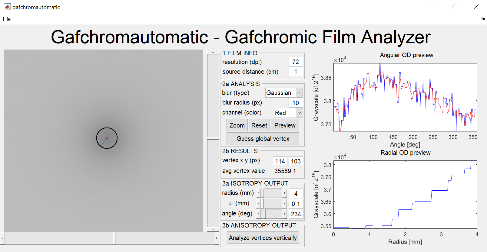

# Gafchromautomatic
Scan, explore, and analyze RGB channels of irradiated Gafchromic film with MATLAB

## Synopsis
Gafchromautomatic is an in-house film analyzer for the purpose of characterizing isotropic and anisotropic radiation sources. The characterization is performed by relating the film scan grayscale contrast to irradiation dose using basic physics principles of optics and radiation-matter interactions.

This program accelerates the characterization process by automatically scanning the film to find the "peak darkness" with an N-by-N seek matrix. The utility of the seek matrix is the increased likelihood of finding the true irradiation vertex by averaging accross the matrix dimensions, washing out potential spikes in the data. For added convenience, an angular and radial grayscale function is plotted for user defined radius (and tolerance) with the option to save these data to text-based CSV-like files.

This program is a remake of the now defunct [GFRGB](https://github.com/WPIRadiationPhysics/GFRGB).

## Features
- Course-grain scan of region-of-interest to find vertex of lowest grayscale
- Immediate anisotropic critical-angle-of-interest from defined vertex location
- Graphical and text output of radial and absolute/averaged angular grayscale data

## Usage
1. Run gafchromautomatic.m in MATLAB
2. Select an RGB Tiff image with *File->Open TIFF*
3. Scan the image to find the vertex of lowest grayscale:
    1. Zoom into a sub-area of the image with *Zoom* and *Reset*
    2. Set image dots-per-inch parameter with *dpi*
    3. Set length averaging scanning matrix scanning with *scan NxN*
    4. Initialize analysis with *Guess vertex*
4. Override analysis parameters including vertex, location with horizontal and vertical sliders
5. Select analyzing radius and averaging tolerance with respective sliders
6. Override critical angle with slider
7. Save absolute/averaged angular data to files with *File->Save outputs*

## Issues

### High priority
- [Immovable slider and unchanging edit box for critical angle override](https://github.com/WPIRadiationPhysics/Gafchromautomatic/issues/3)

### Medium priority
- [Save radial grayscale array with save outputs function](https://github.com/WPIRadiationPhysics/Gafchromautomatic/issues/6)

### Low priority
- [Support one-channel TIFF image input](https://github.com/WPIRadiationPhysics/Gafchromautomatic/issues/1)
- [Import multiple scans for initial averaging](https://github.com/WPIRadiationPhysics/Gafchromautomatic/issues/2)
- [Create file save dialog box function](https://github.com/WPIRadiationPhysics/Gafchromautomatic/issues/5)