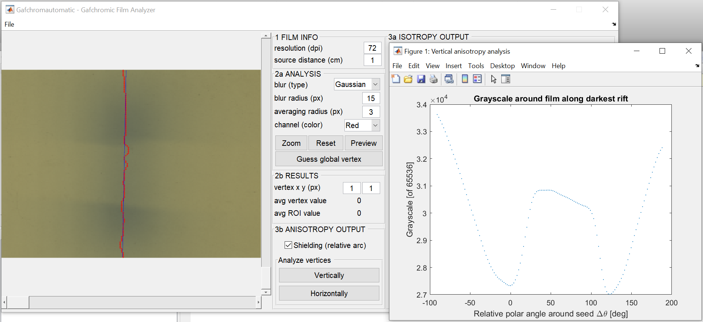

# Gafchromautomatic
Scan, explore, and analyze RGB channels of irradiated Gafchromic film with MATLAB

## Synopsis
Gafchromautomatic is an in-house film analyzer for the purpose of characterizing isotropic and anisotropic radiation sources. The characterization is performed by relating the film scan grayscale contrast to irradiation dose using basic physics principles of optics and radiation-matter interactions.

This program accelerates the characterization process by automatically scanning the film to find the global minimum value (correlating to highest optical density from greatest irradiation). The film scan can be filtered with a customized mean or gaussian blur, washing out potential spikes in the data and increasing the likelihood of determining the global image vertex.

For isotropy analysis users, an angular and radial grayscale function is plotted for user defined radius (and tolerance) with the option to save these data to text-based CSV-like file. The radius and tolerance can both be set in steps of 0.1 mm, and radial grayscale function is determined along an automatically calculated "critical angle" along steepest descent. The vertex location and critical angle can be overridden.

For anisotropy analysis users, a linear grayscale function is constructed along the vertical of the scan image. For verification, each local minimum value by row is plotted with a marker upon the image, and a plot of the axis versus intensity is generated. This final plot data is savable to a text-based CSV-like file.

This program is a remake of the now defunct [GFRGB](https://github.com/WPIRadiationPhysics/GFRGB).

## Features
- Course-grain scan of region-of-interest to find vertex of lowest grayscale
- Immediate isotropic critical-angle-of-interest from defined vertex location
- Graphical and text output of radial and absolute/averaged angular grayscale data

## Usage
1. Run gafchromautomatic.m using the latest version of MATLAB.
2. Select an RGB Tiff image with *File->Open TIFF*.
3. Define film scan resolution and distance from source.
4. Select image blur filter type, blur radius, and film color channel.
5. Zoom into a sub-area of the image with *Zoom* and *Reset*.
6. Initialize analysis with *Guess vertex*.
7. FOR ISOTROPIC ANALYSIS:
    1. Override vertex x and y location with sliders or boxes.
    2. Set analysis radius and tolerance with sliders or boxes.
    3. Override critical intensity angle with slider or box.
    4. Save absolute/averaged angular data to file with *File->Save isotropy outputs*
OR
7. For ANISOTROPIC ANALYSIS:
    1. Initialize analysis with *Analyze vertices vertically*.
    2. Save vertical vertices data to file with *File->Save anisotropy outputs*.

## Issues
Priorities in order of appearance per category

### General
- [Support one-channel TIFF image input](https://github.com/WPIRadiationPhysics/Gafchromautomatic/issues/1)
- [Import multiple scans for initial averaging](https://github.com/WPIRadiationPhysics/Gafchromautomatic/issues/2)

### Isotropy analysis
- [Save radial grayscale array with save outputs function](https://github.com/WPIRadiationPhysics/Gafchromautomatic/issues/6)